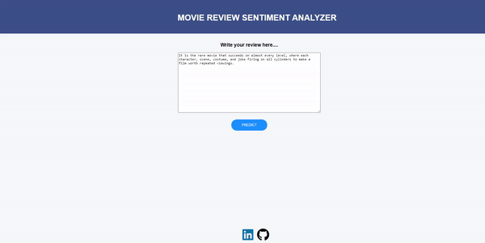

# Movie-Review-Sentiment-Analyzer
**This web app performs sentiment analysis with scikit-learn and NLTK on the popular IMDB data set. A logistic regression model is build to classify movie reviews as either positive or negative. It is built on Python and Flask and deployed on Heroku Platform.**

You can get the IMDB Dataset from here : http://ai.stanford.edu/~amaas/data/sentiment

### Demo

[Check out the Deployed Model!!!!!](https://movie-reviews-web-app.herokuapp.com/predict)

Please give a ⭐ if you liked it.
